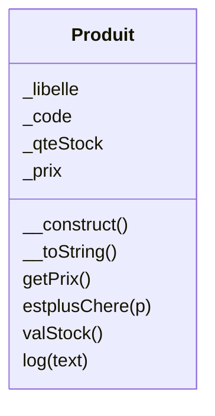

# Base du MVC en Objet

## Mission 1
Mettre les classes :
1. Dispatcher
2. Controller
3. PdoBridge
4. Session
Dans un répertoire nommé **Middelware**
>**TEST :** Lancer l'application pour vérifier que tout fonctionne
  
Mettre la classe **Gerer** dans un répertoire nommé **Controller**
>**TEST :** Lancer l'application pour vérifier que tout fonctionne
  
Mettre les fichiers commençant par **v_** dans un répertoire nommé **Views**
>**TEST :** Lancer l'application pour vérifier que tout fonctionne

